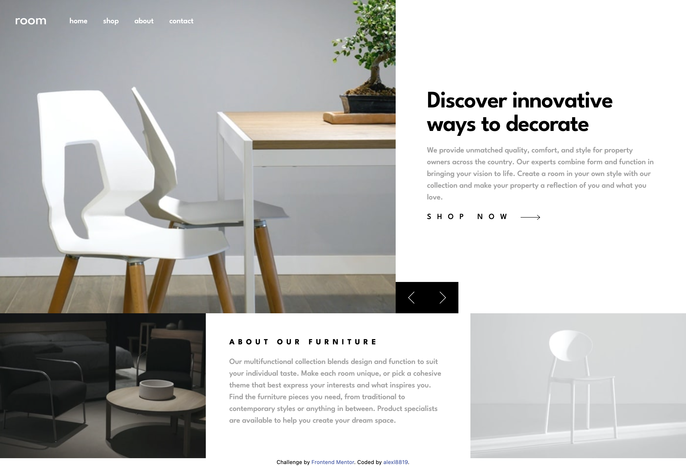
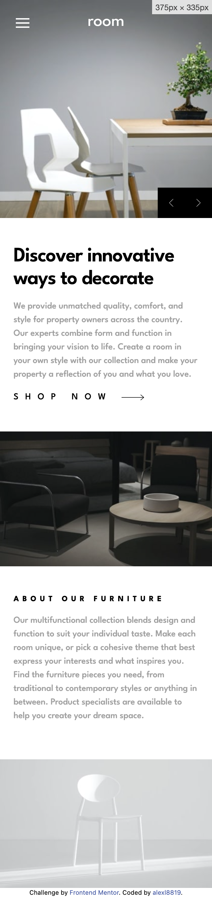

# Frontend Mentor - Room homepage solution

This is a solution to the [Room homepage challenge on Frontend Mentor](https://www.frontendmentor.io/challenges/room-homepage-BtdBY_ENq). Frontend Mentor challenges help you improve your coding skills by building realistic projects. 

## Table of contents

- [Overview](#overview)
  - [The challenge](#the-challenge)
  - [Screenshot](#screenshot)
  - [Links](#links)
- [My process](#my-process)
  - [Built with](#built-with)
  - [What I learned](#what-i-learned)
  - [Continued development](#continued-development)
- [Author](#author)

## Overview

### The challenge

Users should be able to:

- View the optimal layout for the site depending on their device's screen size
- See hover states for all interactive elements on the page
- Navigate the slider using either their mouse/trackpad or keyboard

### Screenshot

### Links

- Live Site URL: [Room Homepage](https://slightlyfunctional.gitlab.io/room-homepage/)

## My process

### Built with

- Semantic HTML5 markup
- Flexbox
- CSS Grid
- Mobile-first workflow
- [Parcel](https://parceljs.org/) - JS Bundler
- [TailwindCSS](https://tailwindcss.com/) - CSS framework

### What I learned

This was my first actual attempt of writing my own mobile nav without the use of a third party library. I am ok with it overall however I definitely think there could be improvements such as the translucent mask
that does not fully cover the viewport (bug). I decided to use no JS framework for this one as I wanted to go bare-bones and rely mainly on CSS. The vanilla JS used is to implement the slider and a reset on the nav (when opened and the viewport size changes).

### Continued development

As always the goal is to write a readable (easy to understand), clean (linted) and tested codebase. I will be focusing on performance metrics again soon and begin to implement SEO into future projects. Some people have asked may why I continue to use Parcel when Vite or esbuild is available? My answer is simple, I find Parcel's zero configuration useful as my go-to "quick to prototype" when building something simple that would not require much complexity. If the project requirements call for more advanced tooling or bundlers then I use a more suitable choice when necessary.

## Author

- Frontend Mentor - [@alexl8819](https://www.frontendmentor.io/profile/slightly-functional)
